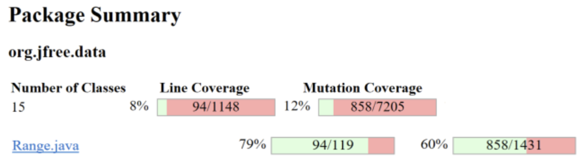
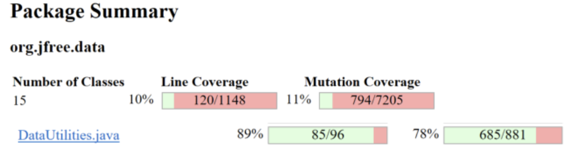
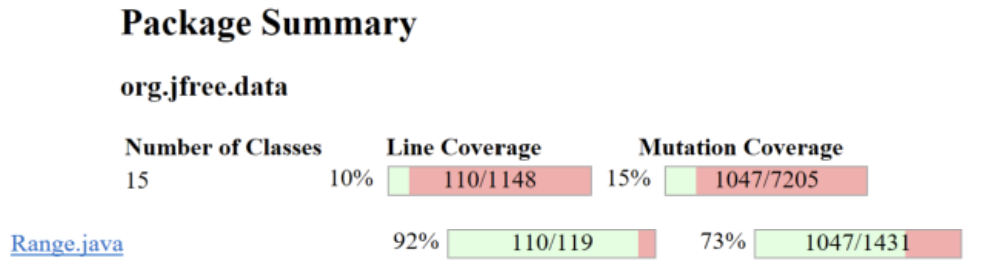
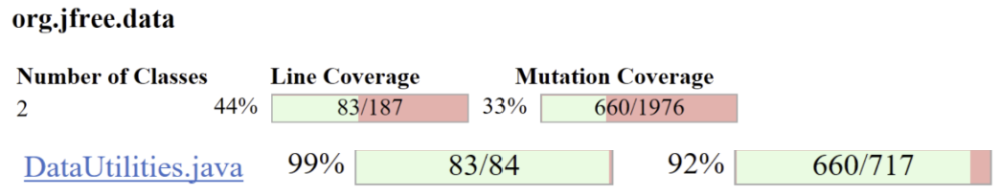
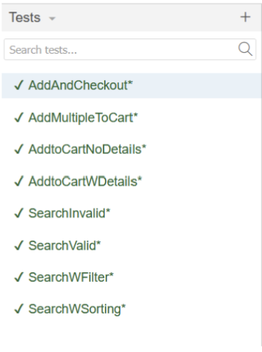

**SENG 438 - Software Testing, Reliability, and Quality**

**Lab. Report \#4 – Mutation Testing and Web app testing**

| Group \#:           |     |
|---------------------|-----|
| Student Names:      |     |
|   Shahed Issa       |     |
|   Neha Parmar       |     |
|   Jaival Patel      |     |
|   Jaisumer Sandhu   |     |

# Introduction

This lab explores two essential aspects of software testing: Mutation Testing and GUI Testing. The objective is to gain hands-on experience with mutation testing to assess the robustness of test suites and to explore GUI testing through automation tools.

In the first part, we use a mutation testing tool, Pitest, to introduce mutants into Java classes Range.java and DataUtilities.java. By executing our test suites against these mutants, we evaluate the mutation score and enhance the effectiveness of our test cases. This process helps us understand how well our test suite can detect subtle faults and allows us to refine our test cases to increase fault detection capability.

The second part of the lab involves automated GUI testing using Selenium. We design and execute test cases for selected web applications, verifying their correctness through automated checks. Additionally, we compare Selenium with an alternative tool, Sikulix, evaluating their respective strengths and limitations

# Analysis of 10 Mutants of the Range class 

# Mutation Testing Results

## getLength
**Mutation:** Replaced subtraction with addition (**Killed**)  
**Explanation:** Changed `return this.upper - this.lower;` to `return this.upper + this.lower;`, altering the length calculation.  
**Why Killed:** The test suite asserts the correct length calculation, and adding instead of subtracting resulted in incorrect values, causing test failures.  

## combine
**Mutation:** Replaced double assignment with `0.0d` (**Killed**)  
**Explanation:** The upper bound of the combined range was assigned `0.0d` instead of its correct value.  
**Why Killed:** The test suite verifies the correctness of the upper and lower bounds in combined ranges, and an incorrect assignment caused failures.  

## intersects
**Mutation:** Replaced boolean return with `false` (**Killed**)  
**Explanation:** Forced the method to always return `false`, making it appear as if no ranges intersected.  
**Why Killed:** The test suite has assertions verifying intersection behavior, and always returning `false` caused failures.  

## constrain
**Mutation:** Replaced double assignment with `0.0d` (**Killed**)  
**Explanation:** Instead of assigning `result = this.upper;`, the mutation assigned `result = 0.0d;`, altering the constraint logic.  
**Why Killed:** The test suite verifies that `constrain()` correctly adjusts values within the range, and returning `0.0d` instead of the upper bound caused assertion failures.  

## scale
**Mutation:** Replaced multiplication with division (**Killed**)  
**Explanation:** Instead of multiplying the lower bound by a scaling factor, the mutation changed it to division, altering the scaling logic.  
**Why Killed:** The test suite verifies the correctness of the scaling operation, and dividing instead of multiplying produced incorrect results, causing test failures.  

## getLowerBound
**Mutation:** Replaced return value with `0.0d` (**Killed**)  
**Explanation:** Instead of returning `this.lower`, the mutation returned `0.0d`, altering the method’s output.  
**Why Killed:** The test suite asserts that `getLowerBound()` returns the correct lower bound, and an incorrect return value caused failures.  

## getLowerBound
**Mutation:** Removed conditional - replaced comparison check with `false` (**Survived**)  
**Explanation:** This mutation removed the `if (lower > upper)` check inside `getLowerBound()` and replaced it with a constant `false`, meaning the `IllegalArgumentException` is never thrown, even when `lower > upper`.  
**Why Survived:** The test suite does not explicitly test `getLowerBound()` when the `Range` object is in an invalid state (i.e., `lower > upper`). The tests likely focus on valid ranges and retrieving the lower bound under normal conditions.  

## contains
**Mutation:** Changed conditional boundary (**Survived**)  
**Explanation:** Modified the condition in `if (value < this.lower)`, affecting boundary checks.  
**Why Survived:** The test suite likely checks general containment but lacks tests for exact boundary conditions.  

## contains
**Mutation:** Changed conditional boundary (**Survived**)  
**Explanation:** Modified the condition in `if (value > this.upper)`, affecting upper-bound checks.  
**Why Survived:** Similar to mutation 159.1, this indicates missing edge-case tests for exact boundary conditions.  

## getCentralValue
**Mutation:** Incremented (`a++`) the lower field (**Survived**)  
**Explanation:** Increased the lower field after it was used in the central value calculation.  
**Why Survived:** The test suite does not verify whether `lower` changes after calling `getCentralValue()`, as the increment does not affect the return value.  

# Report all the statistics and the mutation score for each test class
RangeTest.java: 

DataUtilitiesTest.java:

# Analysis drawn on the effectiveness of each of the test classes

## RangeTest.java

### Boundary Tests
- **`testToString_крайниеValues`**, **`testContains_boundaryValues`**:  
  These tests check edge cases like the maximum and minimum values (e.g., `Double.MAX_VALUE`), ensuring that the range boundaries and string representations are accurate.

### NaN Handling
- **`testContains_NaN`**, **`testCombineIgnoringNaN_withNaN`**, etc.:  
  These tests verify that the `Range` class correctly handles `NaN` values in various methods, such as containment and combination.

### Range Combination
- **`testCombineWithNonOverlappingRanges`**, **`testCombineWithOverlappingRanges`**:  
  The test cases explore combining ranges, whether they overlap or not. They check that the correct minimum and maximum values are chosen when ranges are combined.

### Shifting and Scaling
- **`testShiftZero`**, **`testScaleByOne`**, **`testShiftWithAllowingZeroCrossing`**:  
  These tests validate the functionality of shifting or scaling a range by a certain value or factor. They ensure that boundaries are updated correctly when a shift or scale operation is applied.

### Expanding and Constraining Ranges
- **`testExpandWithFractionalMargins`**, **`testConstrainAtLowerBoundary`**, etc.:  
  These tests check the expansion and constraint logic, ensuring that the range is correctly expanded or constrained given specific inputs.

### Equality and `hashCode`
- **`testEqualsWithNaNLower`**, **`testEqualsWithExtremeValues`**, etc.:  
  These tests examine how the `Range` class compares ranges, particularly when the ranges involve extreme or invalid values like `NaN`. Hash codes are checked for consistency.

### Edge Cases
- **`testExpandEdgeCase`**, **`testCombineWithNull`**, etc.:  
  Tests designed for edge cases like `null` values, zero-length ranges, and extreme expansions.

## DataUtilities.java

### Targeted Edge Cases
#### Negative Indices  
- Added tests for invalid row/column indices (e.g., `-1`) to ensure exceptions or proper handling.

#### Extreme Values  
- Validated `Double.MAX_VALUE`, `Double.MIN_VALUE`, and `Double.NaN` in array conversions and equality checks.

### Precision & Arithmetic Validation
#### NaN Handling  
- Tested equality of arrays containing `NaN` (which is not equal to itself by default).

#### Tiny/Large Values  
- Added tests for cumulative percentages with values spanning orders of magnitude (e.g., `1e-20` and `1e20`).

### Structural Equality & Cloning
#### Deep Cloning  
- Verified that cloned arrays are independent of the original (e.g., modifying a clone doesn’t affect the source).

#### Subarray Lengths  
- Checked inequality for arrays with differently sized subarrays.

### Exception & Boundary Testing
#### Zero Totals  
- Ensured cumulative percentages return `0.0` when all values are zero.

#### Empty Arrays  
- Tested cloning and calculations for empty arrays and `null`-containing subarrays.

### Loop & Index Fixes
#### Off-by-One Errors  
- Added tests for sums involving the first/last row/column.

#### Invalid Indices  
- Validated behavior for out-of-bounds indices (e.g., `Integer.MAX_VALUE`).

# A discussion on the effect of equivalent mutants on mutation score accuracy

Equivalent mutants are a special case in mutation testing. These are mutants that are syntactically different from the original code, yet behave identically in all scenarios. This means that the tests will not detect any difference between the original code and its mutant, resulting in no change in the test outcome. Equivalent mutants do not provide any additional value in evaluating the test suite because they do not introduce any new behavior that can be verified by the tests.

The presence of equivalent mutants can significantly affect the accuracy of mutation scores. Mutation scores are calculated by dividing the number of detected mutants (i.e., those that cause tests to fail) by the total number of mutants (including equivalent mutants). If equivalent mutants are not identified and removed, they inflate the total count of mutants, artificially lowering the mutation score. This means that a test suite might appear less effective than it actually is, because some of the mutants it could not "kill" were equivalent to the original code and had no effect on behavior.

For example, in the context of classes like Range and DataUtilities, equivalent mutants could arise from changes in formatting, such as swapping two variables with identical values, which would not affect the execution of the program. Detecting and excluding these mutants would result in a more accurate mutation score and better insights into the effectiveness of the test suite.

# A discussion of what could have been done to improve the mutation score of the test suites

## Improving Mutation Score

Based on the results from the mutation testing conducted, several strategies could have been employed to improve the mutation score of the test suites:

### Increase Test Coverage  
Although high code coverage metrics such as line or branch coverage are useful, mutation testing goes beyond that by evaluating how well the test suite can detect specific mutations. To improve the mutation score, increasing test coverage, especially for less tested areas such as error-handling code, infrequent code paths, or complex conditional logic, would help detect more mutants.

### Focus on Edge and Boundary Cases  
Mutation testing often uncovers missed test cases that do not account for edge conditions, such as `null` values or extreme input values. Expanding tests to include a broader range of boundary and edge cases would ensure that the mutation score increases by detecting mutations related to these conditions.

### Improve Test Granularity  
Writing more granular test cases that focus on small, specific units of functionality (such as individual functions or components) helps in isolating the effects of mutations. This finer-grained approach increases the likelihood of catching mutations that affect only a particular function.

### Test Different Input Combinations  
Mutation testing often reveals the inadequacy of tests that don’t cover all possible input combinations. By extending the test cases to include combinations of inputs that cover more diverse scenarios, such as boundary conditions, `null` inputs, or unexpected values, the test suite can improve its effectiveness in killing mutants.

### Remove Redundant Tests  
It is essential to identify and remove redundant tests that do not contribute to killing more mutants. These redundant tests can artificially inflate the mutation score without adding meaningful value. By focusing on non-redundant, impactful tests, the mutation score can be optimized.

# Why do we need mutation testing? Advantages and disadvantages of mutation testing

## Why Do We Need Mutation Testing?

### Improving Test Effectiveness  
Traditional code coverage metrics like line or branch coverage do not necessarily guarantee that the tests will catch defects. Mutation testing goes beyond coverage metrics and evaluates how well the test suite can detect subtle code changes. This ensures that the test suite is effective in identifying potential issues in the code.

### Ensuring Robustness  
Even a high-coverage test suite may fail to catch defects if the tests are not designed to detect specific types of bugs. Mutation testing allows developers to identify weak spots in the test suite, making it more robust and reliable for future use.

### Enhancing Confidence  
By using mutation testing to identify areas where test cases fail, developers can gain greater confidence in the effectiveness of their test suite, knowing that it is capable of detecting subtle defects that may not be immediately obvious.

## Advantages of Mutation Testing

### Improved Test Quality  
Mutation testing forces the test suite to detect small code changes, ensuring that the tests are rigorous and robust. This helps improve the overall quality of the software.

### Identification of Weak Test Cases  
Mutation testing helps pinpoint weak or ineffective test cases that fail to detect certain types of faults. By identifying these gaps, developers can focus on strengthening their test suites.

### Increased Coverage  
While coverage metrics only measure the code lines or branches tested, mutation testing goes deeper, evaluating how well the test suite can detect realistic errors. This results in more comprehensive test coverage and better fault detection.

### Detection of Missing Test Cases  
Mutation testing can uncover cases where test cases are missing. This ensures that the system has tests for all critical paths and edge cases, reducing the likelihood of bugs slipping through the cracks.

### Confidence in Code Reliability  
High mutation scores increase confidence in the reliability of the test suite and the correctness of the software. This can be particularly important when developing critical systems.

## Disadvantages of Mutation Testing

### High Computational Cost  
Mutation testing can be computationally expensive because it requires creating and executing many mutants (mutated versions of the code). This can significantly increase testing time and resources, particularly for large codebases.

### False Positives and Negatives  
Mutation testing may produce false positives (mutants that are not likely to occur in real-world scenarios) or false negatives (tests that fail to detect meaningful mutations). These results may lead to unnecessary efforts or missed defects.

### Complex Interpretation of Results  
Mutation testing results can be difficult to interpret, especially if a high mutation score is achieved but the tests are still missing real-world issues. Developers must be cautious about over-optimizing their test suites based on the mutation score alone.

# Explain your SELENUIM test case design process

## Website Functional Testing Approach  

We began by analyzing the functional requirements of the website to identify the key interactions that users would have (e.g., searching for items, adding items to the cart). From there, we identified different user scenarios and edge cases (e.g., invalid input, missing details, using filters). We then created clear and distinct test cases for each scenario, ensuring they were modular and reusable for future tests. We also incorporated automated verification points such as checking for the presence of elements, verifying text, and confirming that actions like adding items to the cart resulted in the expected behavior.  

### Testing the Search Functionality  

We created multiple test cases to ensure that many possible user scenarios were covered. These included:  

#### Valid Input  
- Tested searching for a common item (jeans) and verifying that the results returned relevant products.  

#### Invalid Input  
- Tested with invalid search terms (**/) to check that no products are returned, and appropriate messages are shown.  

#### Search with Filters  
- Applied filters (`department → Womens`) and verified that only the filtered items were shown.  

#### Search with Sorting  
- Tested sorting search results (sorting by price low to high) and verified that the items were correctly re-ordered.  

### Testing the Add to Cart Functionality  

We also created several test cases to validate the cart functionality:  

#### Add without Details  
- Tested adding an item to the cart without selecting a size, ensuring that the `"Please select size"` message appeared.  

#### Add with Details  
- Tested adding an item to the cart after selecting a size and color, ensuring that the correct details appeared in the cart.  

#### Adding Multiple of the Same Item  
- Added 4 quantities of the same item to the cart and verified that the quantity was updated correctly.  

#### Checkout vs. Continue Shopping  
- Tested clicking the checkout button after adding an item, verifying that it redirected to the checkout page with the new item added to the bag.  
- Tested clicking `"Continue Shopping"` to ensure the user remained on the site instead of being redirected.  

# Explain the use of assertions and checkpoints

In this lab, we used assertions to validate expected outcomes and checkpoints to confirm intermediate steps in our automated GUI tests. Assertions ensured that key elements appeared as expected, while checkpoints helped verify functionality before proceeding to the next step.

For the search functionality, we asserted that after performing a valid search, the results page displayed the expected text indicating the search query. This confirmed that the search feature was correctly returning relevant results. Similarly, for an invalid search, we asserted that the appropriate error message appeared, ensuring the website properly handled cases where no matches were found. We added asserts after each filter or sort to ensure that the displayed products were the correct subset of the rest.

We also incorporated checkpoints as intermediate validation steps. For example, when testing the shopping cart functionality, we asserted the presence of the “Add to Bag” button before proceeding to checkout. This confirmed that the item selection process was functioning correctly before testing the transition to the checkout page. Once the checkout page was reached, we added an assert text to ensure that the user could see their order summary. 

These assertions and checkpoints provided reliability to our tests by ensuring that each critical step executed as expected before moving forward. All of our tests passed since the Gap website is a professional and properly functioning site:

# how did you test each functionaity with different test data

We used different test data for each test case to ensure full coverage:
For search tests, we tested with different terms such as common product names (e.g., "jeans", "top") and invalid strings (e.g., "**/"). For add-to-cart tests, we varied the size and quantity of items being added (e.g., adding a single item vs. multiple of the same item, adding with and without selecting size).

# Discuss advantages and disadvantages of Selenium vs. Sikulix
## Selenium  

### Advantages  
- Directly interacts with the HTML elements of the Gap website, making it ideal for testing web functionality like search, filters, and adding items to the cart.  
- By using locators like CSS selectors and XPath, it allows for more accurate targeting of dynamic elements, reducing the risk of errors caused by layout changes.  
- Can run tests across multiple browsers (e.g., Chrome, Firefox), so I was able to use the Firefox extension.  

### Disadvantages  
- Requires prior understanding of command, target, and value fields, as well as CSS-based locators versus XPath, so I had to do my research.  
- If the Gap website's UI changes (e.g., CSS class or ID changes), the tests could break, requiring regular updates to locators.  

---

## SikuliX  

### Advantages  
- Uses image recognition, which can be helpful when visual elements change dynamically on the Gap website, such as images or pop-ups.  
- Can automate tasks outside the browser, such as interacting with desktop pop-ups or handling non-web elements.  

### Disadvantages  
- More complex to understand.  
- Can fail if the Gap website's layout or resolution changes, making it less ideal for consistent web testing.  
- Image recognition is slower than direct HTML interaction, making testing more time-consuming.  

# How the team work/effort was divided and managed

Our team adopted a collaborative approach to complete the lab, focusing on a division of tasks that suited each member's strengths and expertise. Neha and Jaival primarily worked on the Selenium automation tasks, handling the design and execution of test cases for the Gap website's search and shopping cart functionalities. Jaisumer and Shahed focused on the mutation testing aspects, specifically working on the Pytest framework for testing Java classes and analyzing mutation scores.

To ensure mutual understanding and synchronization across the project, we held video calls where we shared progress updates and discussed challenges. These discussions allowed us to ensure that everyone was on the same page with the tools and methodologies being used, and provided an opportunity for collaborative problem-solving when issues arose. This cross-explanation of tasks helped develop a deeper understanding of the entire testing process, beyond just individual responsibilities.

# Difficulties encountered, challenges overcome, and lessons learned

Several challenges were encountered during this lab. One of the main issues was with the Pytest framework, which was not functioning correctly on some of our team members' laptops. This required us to have screen-sharing sessions to troubleshoot and resolve the problem together. The process of working together remotely helped us quickly identify and fix the issue, emphasizing the importance of communication and teamwork when dealing with technical roadblocks.

Another challenge occurred while working with Selenium. We encountered difficulties with locating the correct CSS target values for certain elements, which caused assertion failures. After some investigation and using tutorials, we discovered Selenium's built-in method for adding assertions directly by right-clicking on the elements, which helped streamline the process and reduced the need for manual coding of locators. This was a valuable lesson in the efficiency and power of built-in tools in Selenium, which can make automation tasks much easier.

Lastly, understanding and working with Pytest proved to be a bit more complex than anticipated. The syntax and structure were initially confusing, but through collaboration and additional research, we were able to gain a better understanding and successfully implement the tests. Understanding how to modify mutations so they don’t survive was challenging. The goal of mutation testing is to create mutants that our tests can catch, but some mutants were resistant to detection. This required carefully analyzing each test’s coverage and tweaking them to ensure they would kill all mutants. It was a process of trial and error, but we learned that mutation testing is about refining tests to be more comprehensive and resilient to code changes.

# Comments/feedback on the lab itself
Overall, the lab provided many opportunities for learning, both in terms of technical skills and teamwork. By completing this lab, we enhanced our understanding of test quality assessment and automation techniques, which are crucial for improving software reliability and robustness. We learned how to troubleshoot effectively, use different testing tools, and collaborate efficiently to ensure the success of the project. 
