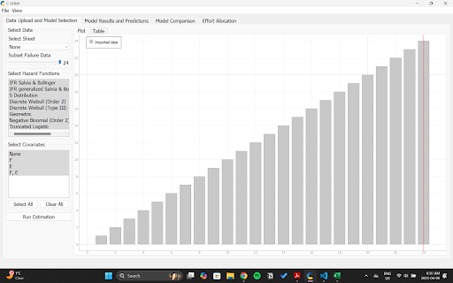
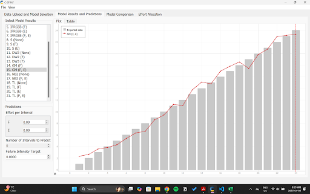
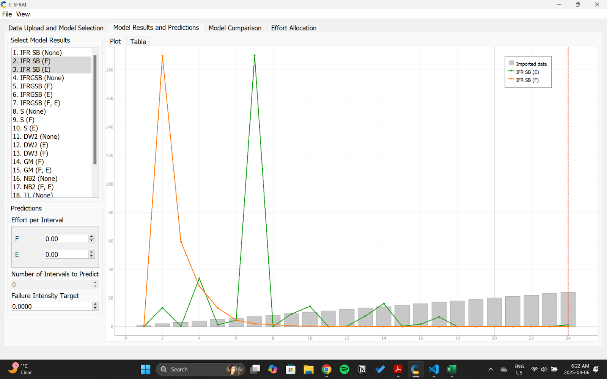
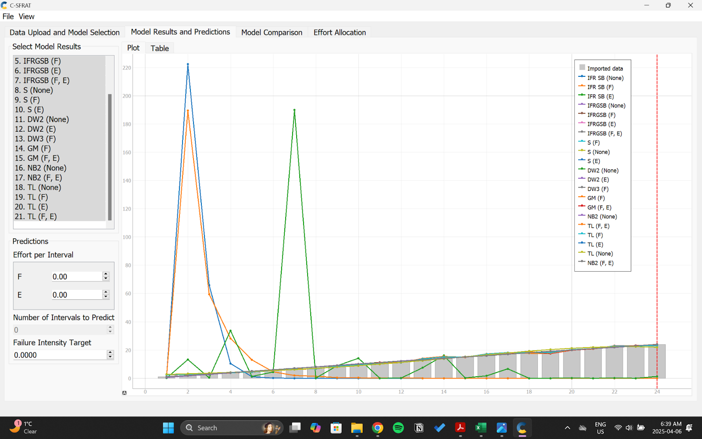
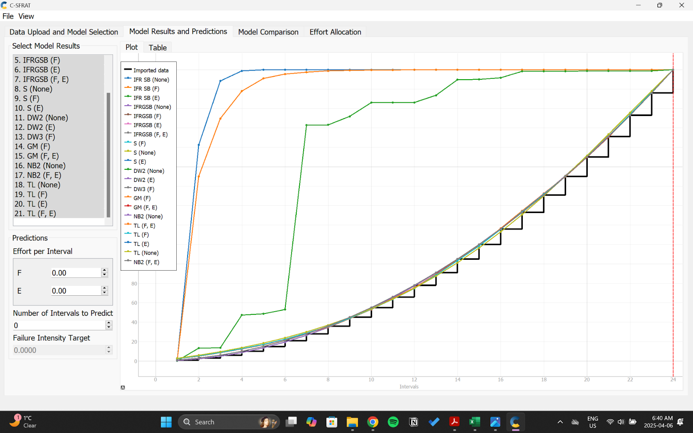
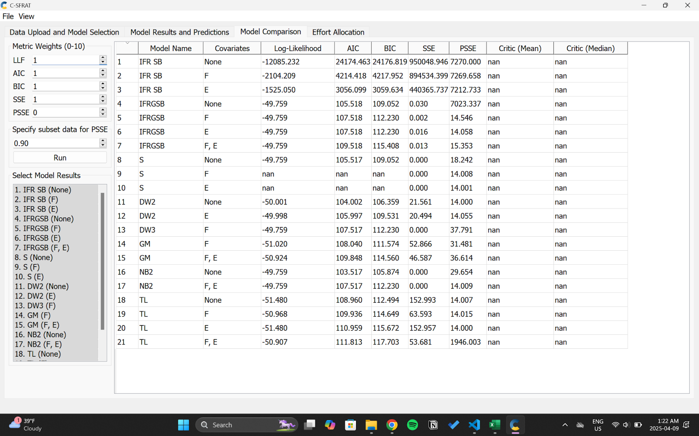
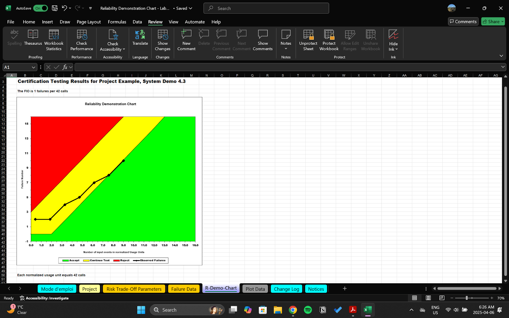
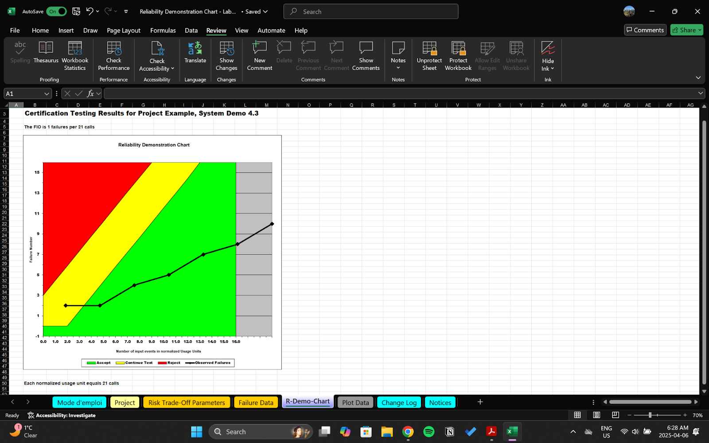

**SENG 438- Software Testing, Reliability, and Quality**

**Lab. Report \#5 – Software Reliability Assessment**

| Group \#:                  |   |
|----------------------------|---|
| Student Names:             |   |
|Shahed Issa                 |   |
|Neha Parmar                 |   |
|Jaival Patel                |   |
|Jaisumer Sandhu             |   |

# Introduction
This lab introduced us to the analysis of integration test data using reliability assessment tools and emphasized the importance of ensuring system quality and dependability. The primary goal was to provide hands-on experience in evaluating the reliability of a hypothetical system by analyzing its failure data collected during integration testing. We explored two key methods: reliability growth testing using tools like C-SFRAT, and reliability assessment through the Reliability Demonstration Chart (RDC) with Excel. In the first part, we used C-SFRAT to gain familiarity with how reliability growth tools track changes in system performance over time. In the second part, we examined how the RDC can help determine the adequacy of testing for a given Mean Time To Failure (MTTF). After that we will change the MTTF to find the minMTTF, twiceMTTF, and half minMTTF and examine the results we get and compare them with each other.

# Assessment Using Reliability Growth Testing 
For the reliability growth testing we used C-SFRAT as provided in the instruction and we chose the dataset 3 and converted it from word to a .csv file. The original word document had the data in seconds, so we correctly formatted it to hours and imputed it into a .csv file and got the following results.

The first image here is for just our dataset in an intensity graph with no models added on top of it:

This is our dataset with the geomatic model added onto it which takes into account the time between failure of the models:

This is the IFR model which stands for Instantaneous Failure Rate implying that how many failures occur within a given point in time:

These next two graphs showcase all the different types of models being applied to or data just in different type of graphs:

This image below showcase the model comparisons and shows the difference between all the different types of models that are applied to the dataset:

With this information we can conclude that out of all the models the best fit for dataset 3 would be the DW2 model as it provided the lowest AIC values and through some external research we were able to come to the conclusion that the lowest AIC value determines the best model for a given dataset.

# Assessment Using Reliability Demonstration Chart 
For the RDC of dataset 3 we implement some changes into the dataset as the RDP excel file only had a maximum input of 16 failure points and our dataset consisted of 24 individual failure counts so in order to combat this issue we used time intervals in order to fit all our data into the excel file. By having a time interval of 60 seconds we were able to fit all 24 failure counts into the 16 inputs as there were certain intervals that had more than one failure count in it thus allowing us to correctly format and implement our dataset into the RDC excel file and provide accurate and correct results.

This image shows our MTTF which was calculated by taking the total time which for us was 960 seconds and this was the case due to the time interval being 60 seconds and the last failure being within this time and dividing it by our total number of failures which was 24 giving us an answer of 40:

In order, to get the MTTFmin we tried multiple different MTTP values until we were able to choose a MTTP value with which the last data point would just reach the accept (green) region:

The MTTFtwice was calculated by taking the MTTP value which is 40 and multiplying it by 2 giving us an result of 80 as our MTTFtwice value and resulted in the data ending up in the reject (red) region:

The half MTTFmin was calculated by taking the MTTPmin value which is 42 and dividing it by 2 giving us a result of as the half MTTPmin value 21 and resulted in the data being far into the accept (green) region:

From the different MTTF values such as MTTF, MTTFmin, MTTFtwice, and half MTTFmin, we can draw meaningful conclusions about our failure dataset. The standard MTTF represents the average time to failure and helps us assess whether the dataset falls within the acceptable failure threshold. With a value of 40, we determined that the dataset was within the acceptable region. The MTTFmin value indicates the minimum MTTF required for the dataset to still be considered acceptable, and in our case, this value was 42. We then examined MTTFtwice, which had a value of 80. This placed the dataset in the reject region, suggesting a higher-than-acceptable failure rate and implying that the software may require significant improvements. In contrast, the half MTTFmin value was 21, which pushed the dataset further into the acceptable region. This suggests a much lower failure rate, indicating that the software is performing well and appears to be the most reliable among the scenarios tested.

# Comparison of Results
Reliability Growth Testing is a process where a system is repeatedly tested to identify and fix flaws, gradually improving its reliability over time. It involves testing under various conditions to expose weaknesses, with progress shown through a reliability growth curve. This type of testing is mainly used while the software is still being tested. In contrast, the Reliability Demonstration Chart uses limited failure data to estimate the probability that a system meets a specific reliability target, based on statistical models of test time or number of units. This type of testing is mainly used after development to test deployment of the software to make sure the software will not face major issues when it is launched. For dataset 3, RGT helped monitor how the system’s reliability is trending and as seen in the graphs above it showcased how the dataset got more reliable over time, while the RDC showed that based on failure timing data, the dataset originally was in the acceptable region meaning it was within the reliability target. Then the other MTTP values were used to gain further information and understanding about RDC.

# Discussion on Similarity and Differences of the Two Techniques
Reliability Growth Testing and Reliability Demonstration Chart both evaluate system reliability using failure data and Mean Time to Failure. RGT is a continuous process that tracks failure counts and inter-failure times to monitor reliability trends over time. It used C-SFRAT to generate growth curves and estimate how much testing is needed to meet reliability goals. RDC, on the other hand, uses inter-failure times at specific intervals to assess whether the system meets reliability requirements. While RGT supports ongoing system improvement for a project that requires constant change and something that is dynamic and long-term modeling. RDC provides a decision on whether a system is acceptable, needs more testing, or falls short of reliability standards. Such an approach would be great for a completed project that is static and needs to test things such as deployment. In summary, RGT focuses on predicting and improving reliability over time, while RDC evaluates whether the reliability target has been met at a given point. Together, they provide a well-rounded view of system dependability.

# How the team work/effort was divided and managed
For this lab, unfortunately there were some teammates that could not get C-SFRAT to run on their devices, so we split up into teams of two where two members were responsible for part 1 and the other two worked on part 2. Furthermore, we made sure to check in on each other to make sure we all knew what we were doing and understood the concepts by making sure that we would meet up every few days to discuss what was done. If any additional help was needed and though both teams were working on different parts, we tried to collaborate whenever we could.

# Difficulties encountered, challenges overcome, and lessons learned
We faced a few challenges during this lab, primarily due to software incompatibilities with Mac OS, which limited access to the required tools like C-SFRAT. This made it difficult for the entire group to work efficiently, as only two group members were able to run the software. To overcome this, we adopted a peer programming approach for those with access to C-SFRAT focused on generating the data visuals, while the others analyzed and interpreted the results collaboratively. Additionally, while working with the RDC, it was initially confusing to determine which values needed adjusting to achieve the desired outcomes. However, through this process, we improved our skills in Excel, particularly in graph creation, and gained a better understanding of how varying the MTTF influences whether a system falls into the reject, continue, or accept regions on the chart.

# Comments/feedback on the lab itself
Overall, this lab provided a valuable hands-on introduction to reliability assessment tools such as reliability growth analysis and reliability demonstration chart. Through which we were able to learn and understand how such practices affect real word projects. The instructions were comprehensible, however it would be helpful if there were more clearer instructions on the RDC part of the lab as where we had to change the values and add our own data was not mentioned in the instruction and the RDC excel file itself is quite large and holds a lot of components within it so it is crucial to let students know what needs to be changed and what no to change.